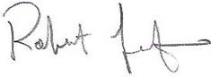

`r paste0(format(Sys.time(), "%B %d, %Y"))`

Robert Leaf, PhD  
2812 Belmont Drive  
Ocean Springs, MS 39564  
E-mail: robert.t.leaf@gmail.com  

`r paste0(company.name)`  
`r paste0(company.loc)`

Dear Hiring Manager at `r paste0(company.name)`  :

Enclosed, please find my application materials for the `r paste0(position.title)` position advertised on the Indeed.com website. I currently hold an academic position as a tenure-track Assistant Professor in the School of Science and Engineering at the University of Southern Mississippi. This is primarily a research position where I am responsible for performing complex statistical analysis, project development, project management, and mentoring graduate students at the MS and PhD level. For a number of reasons, personal and professional, I am very excited to seek a new career path and bring my passion for quantitative analysis to your organization. 

Although the focus of my work, in my current position, is different to the analytics of the `r paste0(industry.type)` industry, in many ways they are fundamentally the same: using data and statistical tools to provide insights and guide decision-making. The primary focus of my work is to create and employ robust statistical tools, primarily simulation and statistical models, to assist in minimizing risk and evaluating tradeoffs. Because my work in fishery science and resource management is necessarily applied, the projects I work on generally have a time-sensitive component that demand pragmatic approaches to maximize productivity. My resume will attest to my productivity and expertise in statistical analysis in both a frequentist and Bayesian paradigm as well as my experience using machine learning algorithms. Many of the projects that I perform require innovative approaches with new data structures and tools. For example, I recently developed a Bayesian hierarchical model to forecast biological production for the second largest fishery in the United States.

A primary aspect of the advertised position with the `r paste0(company.name)` that I am particularly interested in, and one that I am eager to bring value to, is the creation of models and quantitative approaches that will enhance prediction and visualization of complex data structures. To see these results translated to success of the organization is my primary goal and one that I am passionate about. My attached resume will document my experience with the R programming language and the use of large databases. I have taught classes in programming and have a large number of peer-reviewed publications, all of which focus on applications of statistical modeling. One of my strengths in this regard is my experience in communicating the conclusions of modeling to managers that are not particularly interested in every technical aspect of model development but want assurance that appropriate methods are used. For example, in a recent project, I was responsible for communicating the results of a complex statistical model to a regulatory body charged with altering the minimum size limit for the most important recreational fishery in the state of Mississippi. Given the charged atmosphere and so many competing interests, the resource managers wanted to be sure their decisions were based on the best available information. My team delivered the estimates in a timely manner and communicated the results so that managers could make decisions, understanding risks, tradeoffs, and benefits.

I am very interested to discuss with you my goals and qualifications for this position. I have a strong quantitative and programming background and I am very interested in applying these skills to your operations. I look forward to hearing from you.
 
Sincerely,

Robert Leaf